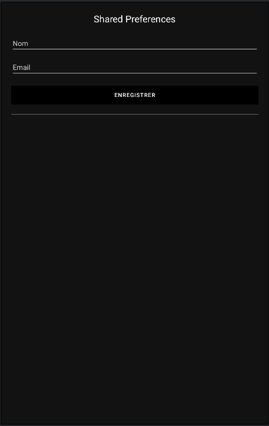

# Rapport de développement d'une application Android native avec SharedPreferences (Kotlin)





## 📄 Contexte du projet

Ce projet consiste à développer une application mobile native sous Android utilisant le langage **Kotlin**, dont l'objectif est de permettre à un utilisateur de saisir un **nom** et un **email**, de les **enregistrer** dans un stockage persistant local (SharedPreferences), puis de les afficher **sous forme de liste** dans une interface simple.


## 📊 Fonctionnalités principales

* Saisie du nom et de l'email via deux champs `EditText`
* Sauvegarde des données dans les **SharedPreferences**
* Affichage dynamique de tous les utilisateurs enregistrés sous forme de **tableau textuel**
* Interface moderne en **mode sombre** avec un affichage clair et responsive

## 📖 Technologies et outils

* **Langage** : Kotlin
* **Framework** : Android SDK
* **Stockage** : SharedPreferences (avec JSON)
* **UI** : `LinearLayout`, `ScrollView`, `TextView`, `EditText`, `Button`
* **IDE** : Android Studio

## 🔍 Concepts importants

### SharedPreferences

Permet de sauvegarder de façon persistante des paires clé/valeur sur l'appareil. Ici, on utilise une `JSONArray` en chaîne de caractères pour stocker plusieurs utilisateurs.

### JSON

Format utilisé pour serialiser plusieurs utilisateurs. Chaque utilisateur est représenté par un `JSONObject` contenant `name` et `email`, inséré dans un `JSONArray`.

### UI Dynamique

On utilise un `LinearLayout` avec ID `listLayout` pour ajouter dynamiquement des `TextView` pour chaque enregistrement.

---

## 📄 Fichier `activity_main.xml`

```xml
<ScrollView ...>
    <LinearLayout android:id="@+id/mainLayout" ...>

        <TextView android:text="Shared Preferences" ... />

        <EditText android:id="@+id/editTextName" ... />
        <EditText android:id="@+id/editTextEmail" ... />

        <Button android:id="@+id/btnSave" ... />

        <View ... /> <!-- Ligne de séparation -->

        <LinearLayout android:id="@+id/listLayout" ... />

    </LinearLayout>
</ScrollView>
```

---

## 📄 Fichier `MainActivity.kt`

```kotlin
class MainActivity : AppCompatActivity() {

    private lateinit var nameInput: EditText
    private lateinit var emailInput: EditText
    private lateinit var saveBtn: Button
    private lateinit var listLayout: LinearLayout
    private lateinit var prefs: SharedPreferences

    private val PREF_NAME = "mypref"
    private val KEY_LIST = "user_list"

    override fun onCreate(savedInstanceState: Bundle?) {
        super.onCreate(savedInstanceState)
        setContentView(R.layout.activity_main)

        nameInput = findViewById(R.id.editTextName)
        emailInput = findViewById(R.id.editTextEmail)
        saveBtn = findViewById(R.id.btnSave)
        listLayout = findViewById(R.id.listLayout)

        prefs = getSharedPreferences(PREF_NAME, Context.MODE_PRIVATE)

        showList()

        saveBtn.setOnClickListener {
            val name = nameInput.text.toString()
            val email = emailInput.text.toString()
            if (name.isNotEmpty() && email.isNotEmpty()) {
                addUserToPrefs(name, email)
                nameInput.text.clear()
                emailInput.text.clear()
                showList()
            }
        }
    }

    private fun addUserToPrefs(name: String, email: String) {
        val jsonArray = JSONArray(prefs.getString(KEY_LIST, "[]"))
        val user = JSONObject()
        user.put("name", name)
        user.put("email", email)
        jsonArray.put(user)
        prefs.edit().putString(KEY_LIST, jsonArray.toString()).apply()
    }

    private fun showList() {
        listLayout.removeAllViews()
        val jsonArray = JSONArray(prefs.getString(KEY_LIST, "[]"))
        for (i in 0 until jsonArray.length()) {
            val user = jsonArray.getJSONObject(i)
            val row = TextView(this)
            row.text = "👤 ${user.getString("name")}  |  📧 ${user.getString("email")}"
            row.setTextColor(resources.getColor(android.R.color.white))
            row.textSize = 16f
            row.setPadding(0, 8, 0, 8)
            listLayout.addView(row)
        }
    }
}
```

---

## 📷 Captures d'écran (exemples)

* Interface vide avec formulaire
* Après ajout d'un utilisateur (liste s'affiche)

*(à insérer en liant vos propres captures PNG/JPG ici)*

---

## 📚 À retenir pour développer ce type d'application

* **SharedPreferences** : Idéal pour des données simples sans base de données
* **JSONArray/JSONObject** : Utiles pour stocker plusieurs objets
* **UI dynamique** : Possible sans RecyclerView si la liste est courte
* **Bonne pratique** : Toujours vérifier la validité des champs avant enregistrement
* **ScrollView** : Important pour assurer la lisibilité sur petits écrans

---

## 💪 Possibilités d'évolution

* Ajouter un bouton "Effacer tout"
* Utiliser RecyclerView pour des listes plus longues
* Ajouter validation d'email et confirmation visuelle
* Sauvegarder avec Room si les données deviennent plus complexes

---

> Ce projet est une excellente base pour comprendre le stockage local simple et la création d'interfaces dynamiques en Kotlin/Android.

